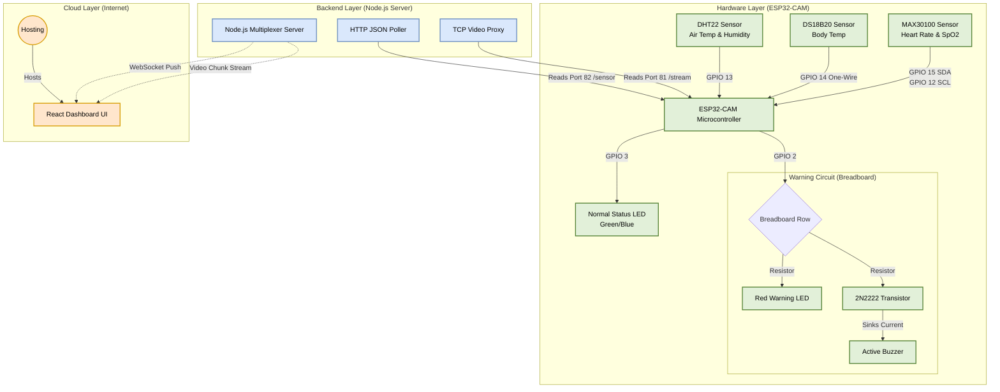

# Complete System Architecture & Wiring Diagram

This diagram maps out the entire Infant Incubator ecosystem, from the physical hardware sensors plugged into the ESP32-CAM, all the way up to the cloud-hosted React dashboard on Cloudflare.

## Full System Flowchart

### Layer Breakdown

1. **Hardware Layer:** The ESP32-CAM constantly reads data from the three primary sensors using its specific GPIO pins. If the Body Temp falls outside of 30-35°C, it sends a 3.3V signal out of **GPIO 2**, hitting your breadboard node, which simultaneously triggers the Red LED and opens the Transistor to blast the 5V Buzzer.
2. **Backend Layer:** The Node.js server sits on the network and acts as a shield for the ESP32. It asks the ESP32 for data exactly once per second, preventing the tiny microcontroller from crashing under heavy traffic. 
3. **Cloud Layer:** Your React frontend is globally hosted on **Cloudflare Pages**. When a doctor opens the website from anywhere in the world, the website connects back to your Node.js server via WebSockets to stream the live incubator data and video feed seamlessly.
