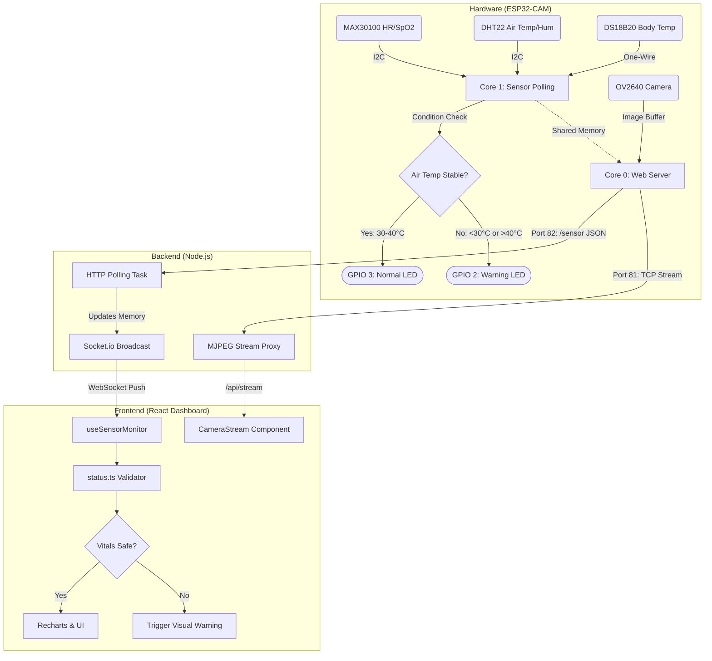

# System Architecture and Workflow of an IoT-Based Smart Infant Incubator

## Abstract
This report details the architectural design and operational workflow of a real-time, IoT-enabled Smart Infant Incubator monitoring system. The system integrates an ESP32-CAM microcontroller for hardware interfacing and video streaming, a Node.js intermediary server for multiplexing, and a React-based frontend for real-time visualization. The architecture is designed to minimize latency, handle asynchronous sensor polling, and provide responsive visual alerts for critical infant vitals.

---

## 1. Hardware Architecture (ESP32-CAM Core)
The physical layer of the system is governed by an **ESP32-CAM**, which operates using a dual-core architecture (FreeRTOS) to handle asynchronous tasks without blocking the MJPEG video stream.

### 1.1 Pin Assignments & Sensors
- **I2C Bus (GPIO 14 & GPIO 15):** Custom I2C pins used to interface with the **MAX30100** (Heart Rate & SpO₂) sensor and the **DHT22** (Air Temperature & Humidity) sensor.
- **One-Wire Bus:** Interfaces with the **DS18B20** waterproof temperature sensor for highly accurate Body Temperature readings.
- **Status LEDs:**
  - **GPIO 3 (U0R):** Normal Status Light. Remains active while the incubator chamber air temperature is stable (30°C - 40°C).
  - **GPIO 2:** Warning Status Light. Activates when air temperature fluctuates outside the safe range (< 30°C or > 40°C). 
  - *(Note: GPIO 4 was intentionally bypassed for the warning light, as it is hardwired to the ESP32-CAM's high-intensity flash LED, which could cause visual distress.)*

### 1.2 Core Allocation (FreeRTOS)
To maintain real-time responsiveness, the ESP32 firmware is divided across its dual cores:
- **Core 0 (Web Server & Video):** Handles the HTTP server daemon and MJPEG video streaming at 800x600 resolution.
- **Core 1 (Sensor Polling):** 
  - A high-priority pulse task (`pulseTask`) runs continuously to sample the MAX30100 sensor, ensuring no heartbeat cycles are missed.
  - A lower-priority environment task (`sensorTask`) polls the DHT22 (every 2s) and DS18B20 (every 1s) and evaluates the logic for the Status LEDs.

---

## 2. Backend Infrastructure (Node.js & Socket.io)
The backend acts as a crucial multiplexing layer. Because the ESP32-CAM has limited processing power and concurrent connection limits, the Node.js server prevents the microcontroller from crashing under the load of multiple web clients.

### 2.1 The Data Pipeline
- **Sensor Data (Port 82):** The Node.js server uses `Axios` to poll the ESP32's `/sensor` endpoint every 1000ms. It stores the latest JSON payload in memory.
- **WebSocket Broadcast:** The server utilizes `Socket.io` to instantly broadcast the fetched sensor data to all connected React clients. This reduces the load on the ESP32 to exactly one HTTP request per second, regardless of how many users are viewing the dashboard.

### 2.2 The Video Proxy
- **Video Stream (Port 81):** The Node.js server establishes a persistent TCP connection to the ESP32's MJPEG stream.
- **Multiplexing:** As JPEG frame chunks arrive from the ESP32, the Node.js server acts as a proxy, piping the raw byte stream to all connected frontend clients via `/api/stream`.

---

## 3. Frontend Architecture (React, Vite & Tailwind)
The user interface is a responsive, single-page application built with React and Vite, heavily utilizing Tailwind CSS for glass-morphism aesthetics and Framer Motion for hardware-accelerated animations.

### 3.1 Component Structure
- **App & Routing:** The root `App.tsx` handles session-based authentication (`LoginPage.tsx`). Once authenticated, it renders `Dashboard.tsx`.
- **Custom Hooks (`useSensorMonitor`):** Manages the Socket.io lifecycle, appending incoming data to a historical array (capped at 60 data points) to drive the real-time charts.
- **Status Engine (`status.ts`):** A strict clinical validation layer that evaluates incoming metrics against predefined healthy ranges:
  - **Body Temperature:** 30°C - 35°C
  - **Air Temperature:** 30°C - 40°C
  - **Humidity:** 50% - 70%
  - **Heart Rate & SpO₂:** 60-100 BPM & 95-100%
- **Visualization:** `Recharts` renders smooth, animated line charts for historical trends, while `AnimatedNumber` provides rolling odometers for instant metric reads.

---

## 4. System Workflow Diagram

---

## 5. Workflow Summary
1. The **ESP32-CAM** gathers vitals asynchronously via I2C/One-Wire and independently manages physical LED alerts on Core 1.
2. The **Node.js Server** constantly queries the ESP32 (Core 0), fetching sensor data and proxying the MJPEG stream to prevent microcontroller overload.
3. The **React Dashboard** connects to the Node.js server via WebSockets, receiving instant data pushes.
4. The **Frontend Status Engine** parses the data, updates the visual graphs, and flags any metric that falls outside the defined clinical boundaries, instantly alerting the medical staff via the UI.
