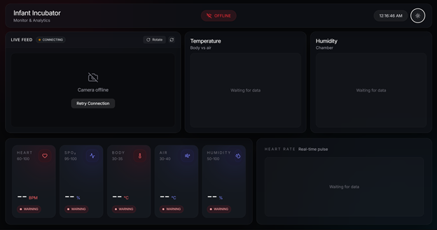
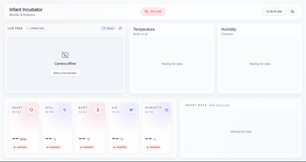
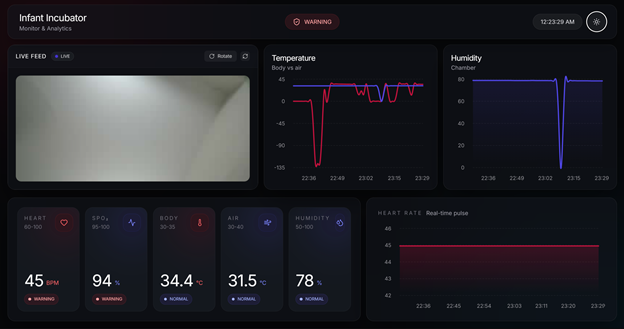
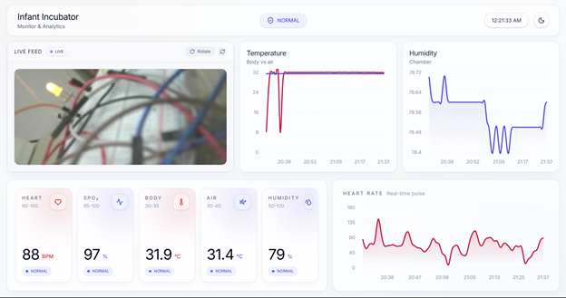
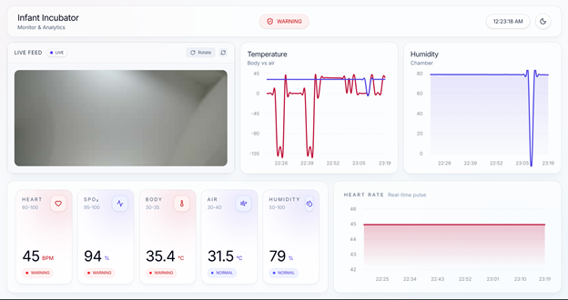
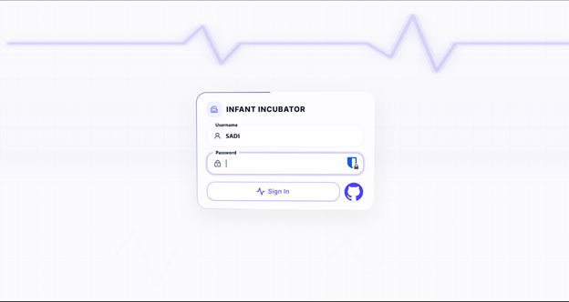

  

  <h3 align="center">Infant Incubator</h3>

  

    A complete dual-core IoT and medical monitoring ecosystem featuring real-time biometric tracking, automated fail-safe alarms, and a live MJPEG video proxy.
     
     
    <b>Live Demo:</b> <a href="https://incubator.betprojects.me">incubator.betprojects.me</a> 
    <i>Username: SADI | Password: SAMIN</i>
  

## About The Project

  

 

This project is a fully integrated IoT Infant Incubator monitoring system. It uses an ESP32-CAM to read vital medical sensors (DHT22, DS18B20, MAX30100) and stream video. To prevent the ESP32 from crashing under heavy load, a custom Node.js multiplexer server acts as a proxy, fetching data from the ESP32 once per second and streaming it to a modern React dashboard via WebSockets.

The hardware features built-in dual-core logic: Core 1 handles the critical sensor polling and fail-safe breadboard circuits (triggering an active buzzer and red LED if body temperature drops), while Core 0 manages the HTTP and video streams. 

## Built With

<table>
  <tr>
    <td align="left">
      <b>Software & Frameworks</b>  
       
       
       
       
       
      
    </td>
    <td align="left">
      <b>Hardware & Components</b>  
       
       
       
       
       
      
    </td>
  </tr>
</table>

## Screenshots

  <table>
    <tr>
      <td align="center"> <b>Dashboard (Dark Mode)</b></td>
      <td align="center"> <b>Dashboard (Light Mode)</b></td>
    </tr>
    <tr>
      <td align="center"> <b>Live Biometrics (Dark)</b></td>
      <td align="center"> <b>Live Biometrics (Light)</b></td>
    </tr>
    <tr>
      <td align="center"> <b>System Warnings</b></td>
      <td align="center"> <b>Secure Medical Portal</b></td>
    </tr>
  </table>

## Features

- **Real-Time Vitals:** Live tracking of Body Temperature, Air Temperature, Humidity, Heart Rate, and SpO2.
- **Hardware Fail-safes:** Custom BJT transistor circuit triggers physical alarms (LED + Buzzer) independently if sensor data spikes or drops below critical thresholds (30°C - 35°C).
- **Video Proxying:** Node.js backend proxies the ESP32 MJPEG camera stream, allowing multiple doctors to view the baby simultaneously without crashing the microcontroller.
- **WebSocket Synchronization:** Instant UI updates and "Server Offline" fail-safe badges if the connection drops.
- **Premium Glassmorphism UI:** Built with TailwindCSS and Lucide-react for a pristine, medical-grade aesthetic.

## Getting Started

### 1. Firmware (ESP32-CAM)
1. Open `firmware/InfantIncubator.ino` in the Arduino IDE.
2. In `Globals.h`, insert your home WiFi credentials.
3. Flash to the ESP32-CAM (remember to unplug GPIO 2 / GPIO 3 during flashing!).

### 2. Backend (Node.js)
1. Navigate to the `/backend` directory.
2. Run `npm install` to install dependencies.
3. Run `node server.js` to start the multiplexer on port 5000.

### 3. Frontend (React)
1. Navigate to the `/frontend` directory.
2. Run `npm install` to install dependencies.
3. Run `npm run dev` to launch the dashboard locally, or build for production using Cloudflare Pages.

## Architecture 

The system utilizes an explicit dual-core processing model on the ESP32 to prevent network blocking, heavily backed by a Node.js proxy layer to distribute the WebSocket load.

👉 **[Click here to view the complete System Architecture Diagram](assets/ArchitectureDiagram.md)**