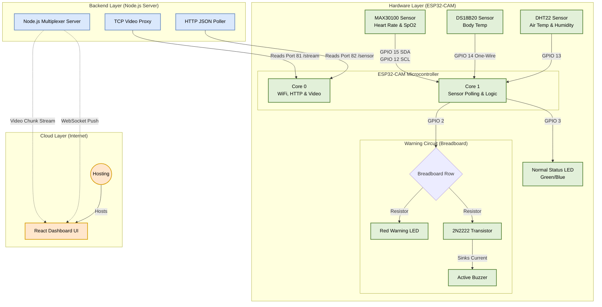

# Complete System Architecture & Wiring Diagram

```mermaid
graph TD
    %% ==========================================
    %% 1. BACKEND LAYER (Node.js Server)
    %% ==========================================
    subgraph "Backend Layer (Node.js Server)"
        Node[Node.js Multiplexer Server]
        Poller[HTTP JSON Poller]
        Streamer[TCP Video Proxy]
    end

    %% ==========================================
    %% 2. HARDWARE LAYER (Incubator Chamber)
    %% ==========================================
    subgraph "Hardware Layer (ESP32-CAM)"
        subgraph ESP["ESP32-CAM Microcontroller"]
            Core0[Core 0\nWiFi, HTTP & Video]
            Core1[Core 1\nSensor Polling & Logic]
        end
        
        %% Sensors
        DHT[DHT22 Sensor\nAir Temp & Humidity]
        DS[DS18B20 Sensor\nBody Temp]
        MAX[MAX30100 Sensor\nHeart Rate & SpO2]
        
        %% Outputs
        LED_N[Normal Status LED\nGreen/Blue]
        
        subgraph "Warning Circuit (Breadboard)"
            NodeA{Breadboard Row}
            LED_W[Red Warning LED]
            Buzzer[Active Buzzer]
            BJT[2N2222 Transistor]
        end

        %% Sensor Connections
        DHT -->|GPIO 13| Core1
        DS -->|GPIO 14 One-Wire| Core1
        MAX -->|GPIO 15 SDA\nGPIO 12 SCL| Core1
        
        %% Output Connections
        Core1 -->|GPIO 3| LED_N
        Core1 -->|GPIO 2| NodeA
        
        %% Warning Circuit Routing
        NodeA -->|Resistor| LED_W
        NodeA -->|Resistor| BJT
        BJT -->|Sinks Current| Buzzer
    end

    %% ==========================================
    %% 3. CLOUD / FRONTEND LAYER
    %% ==========================================
    subgraph "Cloud Layer (Internet)"
        CF((Hosting))
        React[React Dashboard UI]
    end

    %% ==========================================
    %% CROSS-LAYER CONNECTIONS
    %% ==========================================
    Poller -->|Reads Port 82 /sensor| Core0
    Streamer -->|Reads Port 81 /stream| Core0
    CF -->|Hosts| React
    Node -.->|WebSocket Push| React
    Node -.->|Video Chunk Stream| React
    
    %% Hidden link to force vertical stacking
    Core1 ~~~ CF

    %% Legend / Context Styling
    classDef hardware fill:#e2f0d9,stroke:#548235,stroke-width:2px,color:black;
    classDef server fill:#dae8fc,stroke:#6c8ebf,stroke-width:2px,color:black;
    classDef cloud fill:#ffe6cc,stroke:#d79b00,stroke-width:2px,color:black;
    
    class Core0,Core1,DHT,DS,MAX,LED_N,LED_W,Buzzer,BJT hardware;
    class Node,Poller,Streamer server;
    class CF,React cloud;
```
